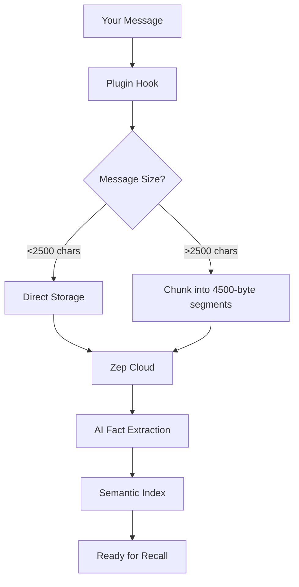

# opencode-withvibes

<div align="center">


**Persistent Memory & Context Management for OpenCode AI Agents**

Give your AI agents long-term memory across conversations and projects via Zep Cloud knowledge graphs.

[Quick Start](#-quick-start) • [Features](#-key-features) • [Documentation](#-documentation) • [GitHub](https://github.com/withvibes/opencode-withvibes)

</div>

---

## 🎯 What This Does

```bash
# Day 1: You mention your preferences
$ opencode run "I prefer React hooks over class components"
# ✅ Stored automatically in your knowledge graph

# Day 7: In a completely new session
$ opencode run "Create a new component for me"
# ✅ Agent recalls your preference and uses hooks without asking
```

This plugin gives OpenCode agents **persistent memory** - they remember your preferences, coding style, and project decisions across all sessions.

## ✨ Key Features

<table>
<tr>
<td width="50%">

### 🧠 Automatic Memory
Every conversation is stored automatically. No manual work required.

### 🔍 Semantic Search
Ask "What CSS framework do I use?" - get answers from past conversations.

</td>
<td width="50%">

### ⚡ Zero Configuration
Set your API key, run `setup`, and it just works.

### 📦 Smart Chunking
Handles messages of any size with automatic splitting.

</td>
</tr>
</table>

## 🚀 Quick Start

### Prerequisites

- OpenCode installed
- [Zep Cloud](https://app.getzep.com) account (free tier available)

### Installation & Setup

```bash
# 1. Install the plugin
bun add opencode-withvibes
# or: npm install opencode-withvibes

# 2. Set environment variables
export ZEP_API_KEY="your-zep-cloud-api-key"
export ZEP_USER_ID="your-unique-id"

# 3. Run automated setup
npx opencode-withvibes setup
```

**That's it!** The setup creates 5 pre-configured agents and you're ready to go.

<details>
<summary><strong>📋 What the setup creates</strong></summary>

<br>

**Primary Agents** (switch with Tab):
- `fullstack` - TanStack development + testing
- `designer` - UI/UX + visual design
- `docs` - Documentation + spreadsheets

**Subagents** (@mention to invoke):
- `tester` - Testing + linting + type checking
- `memory-expert` - Advanced memory queries

**Setup options:**
```bash
npx opencode-withvibes setup           # Basic setup
npx opencode-withvibes setup --overwrite  # Force replace existing agents
npx opencode-withvibes --help          # Show all options
```

</details>

### Usage

```bash
# Everything is remembered automatically
opencode run "I always use Tailwind CSS for styling"
opencode run "For this project, never commit directly to main"

# Later, in any session...
opencode run "Help me style this component"
# → Agent uses Tailwind CSS without asking

opencode run "Should I commit to main?"
# → Agent reminds you of the project policy
```

## 📊 Storage Modes

| Mode | Speed | Persistence Guarantee | Best For |
|------|-------|----------------------|----------|
| **Async** (default) | ⚡ Instant response | ⚠️ Not if crash mid-storage | Normal development |
| **Blocking** | 🐢 100-300ms delay | ✅ Guaranteed | Critical conversations |

```bash
# Default: Async mode (faster)
export ZEP_ASYNC_STORAGE="true"  # or omit - it's the default

# Opt-in: Blocking mode (guaranteed)
export ZEP_ASYNC_STORAGE="false"
```

**Performance characteristics:**

| Operation | Latency | Blocks? |
|-----------|---------|---------|
| Short message (<2500 chars) | ~100-300ms | ❌ / ✅ |
| Long message (10K chars) | ~500-800ms | ❌ / ✅ |
| Very long (50K chars) | ~2-3 seconds | ❌ / ✅ |
| `recall` tool | ~200-500ms | ✅ Always |

## 🧠 How It Works

### Message Flow



**Key components:**

1. **Capture** - `chat.message` hook captures every user/assistant message
2. **Queue** - Serial queue prevents race conditions
3. **Route** - Messages routed by length (direct vs chunked)
4. **Store** - Uploaded to Zep Cloud sequentially
5. **Analyze** - AI extracts facts, entities, relationships
6. **Index** - Searchable via semantic queries

### Privacy & Isolation

| Scope | Isolation Level | How It Works |
|-------|----------------|--------------|
| **User** | Complete isolation | Each `ZEP_USER_ID` gets separate knowledge graph |
| **Project** | Automatic per directory | Thread ID based on directory path |
| **Session** | Cross-session persistence | Same user + same directory = same memory |

## 🛠️ Available Tools

### `remember` - Store Critical Facts

```typescript
remember({ fact: "This project uses the Convex backend" })
```

- Max: 2500 characters
- Use for: Explicit, important facts
- **Note:** Everything is auto-stored anyway - use this only for emphasis

### `recall` - Search Your Memory

```typescript
recall({ query: "backend technology" })
// Returns: "This project uses the Convex backend (2025-10-29 - present)"
```

- Max query: 500 characters
- Returns: Up to 5 most relevant facts
- Semantic search (finds meaning, not just keywords)

## 🔧 Configuration

### Environment Variables

| Variable | Required | Default | Description |
|----------|----------|---------|-------------|
| `ZEP_API_KEY` | ✅ | - | Your Zep Cloud API key |
| `ZEP_USER_ID` | ⚠️ Recommended | `"default-user"` | Unique user identifier |
| `ZEP_THREAD_ID` | ❌ | Auto-generated | Override thread ID |
| `ZEP_DEBUG` | ❌ | `false` | Enable verbose logging |
| `ZEP_ASYNC_STORAGE` | ❌ | `true` | Async storage mode |

### Thread ID Generation

**Default:**
```
thread-{userId}-{md5(directory).substring(0,8)}
```

**Examples:**
```bash
# User: alice, Directory: /Users/alice/my-app
# → Thread ID: thread-alice-a1b2c3d4

# Same user, same directory = same thread = persistent memory
# Different users, same directory = different threads = isolated
```

**Override for permanent thread:**
```bash
export ZEP_THREAD_ID="my-permanent-thread"
# All projects share this thread
```

## 🐛 Troubleshooting

<details>
<summary><strong>Memory not being recalled</strong></summary>

```bash
# 1. Verify API key
echo $ZEP_API_KEY

# 2. Enable debug mode
export ZEP_DEBUG=true
opencode run "test"
# Look for: "[Withvibes] Message stored successfully"

# 3. Check user ID is consistent
echo $ZEP_USER_ID

# 4. View data in dashboard
open https://app.getzep.com
```

**Common causes:**
- Different `ZEP_USER_ID` across sessions
- API key expired/invalid
- Network issues

</details>

<details>
<summary><strong>Lost memory after moving project</strong></summary>

Thread ID is based on directory path. Moving the project changes the thread.

**Fix:**
```bash
export ZEP_THREAD_ID="my-project-thread"
```

</details>

<details>
<summary><strong>Slow performance</strong></summary>

```bash
# Check network latency
ping api.getzep.com

# Enable debug to see timing
export ZEP_DEBUG=true

# Reduce message sizes if seeing "Stored chunk X/Y"
```

</details>

## 🏗️ Development

### Local Setup

```bash
git clone https://github.com/withvibes/opencode-withvibes.git
cd opencode-withvibes
bun install
bun run build
```

### Testing

```bash
# In a test project
cat > opencode.json <<EOF
{
  "plugin": ["../opencode-withvibes"]
}
EOF

export ZEP_API_KEY="your-test-key"
export ZEP_USER_ID="test-user"
export ZEP_DEBUG="true"

opencode run "Test message"
```

### Pre-commit Hooks

Automatically runs on commit:
- **Gitleaks** - Scans for secrets
- **Biome** - Lints and formats code

```bash
bun run lint:fix  # Run manually
```

## 📦 What's Included

<table>
<tr>
<td width="33%">

### 🎨 Design Skills
- Canvas Design
- Algorithmic Art
- GIF Creator
- Theme Factory
- Artifacts Builder

</td>
<td width="33%">

### 📄 Document Skills
- Excel (XLSX)
- Word (DOCX)
- PowerPoint (PPTX)
- PDF Tools

</td>
<td width="33%">

### 🛠️ Dev Skills
- MCP Builder
- Web Testing
- Skill Creator
- Internal Comms
- Brand Guidelines

</td>
</tr>
</table>

**Total: 16 bundled skills** following [Anthropic Skills Specification v1.0](https://github.com/anthropics/skills)

## 📚 Documentation

- [Agent Configuration Guide](./AGENTS.md)
- [Zep Cloud Dashboard](https://app.getzep.com)
- [Zep Documentation](https://help.getzep.com)
- [OpenCode Plugins](https://opencode.ai/docs/plugins)
- [GitHub Repository](https://github.com/withvibes/opencode-withvibes)

## 📄 License

MIT © With Vibes

---

<div align="center">

**Made with ❤️ for persistent AI memory**

[⭐ Star on GitHub](https://github.com/withvibes/opencode-withvibes) • [🐛 Report Bug](https://github.com/withvibes/opencode-withvibes/issues) • [💬 Get Support](https://github.com/withvibes/opencode-withvibes/discussions)

</div>
